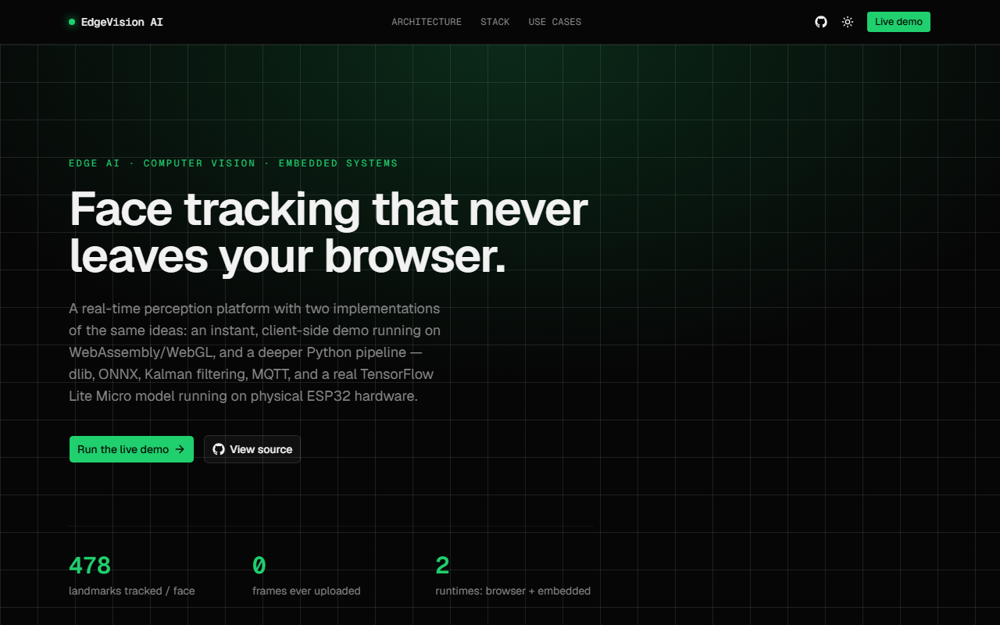
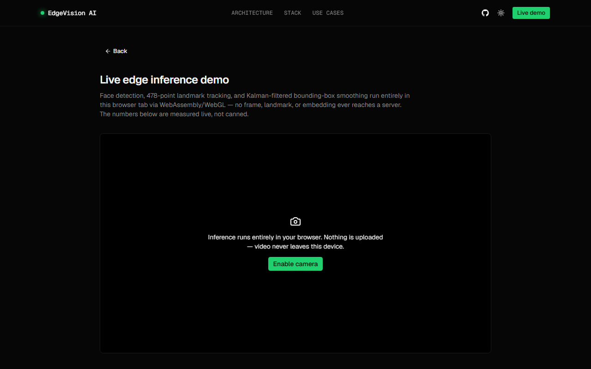

# EdgeVision AI

[](https://github.com/Fouad-Smaoui/TinyML-Driven-Embedded-AI-Vision/actions/workflows/ci.yml)
[](https://github.com/Fouad-Smaoui/TinyML-Driven-Embedded-AI-Vision/actions/workflows/frontend-ci.yml)
[](https://github.com/Fouad-Smaoui/TinyML-Driven-Embedded-AI-Vision/actions/workflows/backend-ci.yml)
[](LICENSE)

**Real-time face/landmark perception running entirely client-side in your
browser — backed by a deeper Python/embedded research pipeline: dlib, ONNX
embeddings, a from-scratch Kalman filter, MQTT, and a real TensorFlow Lite
Micro model running on physical ESP32 hardware.**

[](https://vercel.com/new/clone?repository-url=https://github.com/Fouad-Smaoui/TinyML-Driven-Embedded-AI-Vision&root-directory=frontend&project-name=edgevision-ai&repository-name=edgevision-ai)

No live URL is hosted by the maintainer (deployment needs an account, see
[Deployment](#deployment)) — click the button above to deploy your own copy
in about two minutes, or run it locally below. · [Architecture](docs/architecture.md) · [License](LICENSE)



## Two ways to see this system

This is two implementations of the same ideas, not one system with a
prototype and a "real" half.

### Track A — Live browser demo (instant, zero install)

Open `/demo`, grant camera access, and MediaPipe's FaceLandmarker runs
**entirely client-side** via WASM/WebGL — no frame, landmark, or embedding
ever reaches a server. A TypeScript port of the same Kalman filter used in
the Python pipeline smooths the tracked bounding box, and FPS/inference/
tracking latency are measured live with `performance.now()`, not staged.

The only network call this track makes is an anonymous, four-number perf
ping to the FastAPI backend every few seconds (`fps`, `inference_ms`,
`tracking_ms`, `delegate`) — the backend's request schema uses
`extra="forbid"`, so it's not just a privacy claim in prose: a payload
carrying a face embedding or frame is rejected with `422` before it reaches
application code (see `backend/tests/test_ping.py`).



### Track B — Embedded / research pipeline (local, Docker, optional real hardware)

The original system, unchanged: dlib HOG face detection + 68-point
landmarks, a constant-velocity Kalman filter (OpenCV), an ONNX Runtime
ArcFace embedding model with proper eye-alignment, cosine-similarity
identity verification, MQTT, and a quantized TensorFlow Lite Micro blink
classifier running real inference on a physical ESP32 — not a disconnected
demo. Runs locally via Docker Compose against a real webcam, with an
optional physical ESP32 on the same network.

Both tracks share the same core ideas — landmark detection, Kalman
smoothing, latency-aware metrics — implemented once in Python for the
embedded pipeline and once in TypeScript for the instant browser demo.

## Features

- Real-time face detection + 478-point landmark mesh, in-browser, via
  `@mediapipe/tasks-vision` (self-hosted WASM + model, not fetched from a
  third-party CDN at runtime)
- A literal TypeScript port of the project's Kalman filter, numerically
  verified against the original `cv2.KalmanFilter`-backed Python
  implementation on a fixed measurement sequence
- Live FPS, inference latency, and tracking latency, computed client-side
  and charted in real time
- A FastAPI backend exposing `/health`, `/status`, `/metrics` (Prometheus
  exposition format), and an anonymous, schema-enforced `/ping` endpoint
- Graceful degradation if the backend is cold or unreachable (free-tier
  hosting sleeps when idle) — surfaced honestly as a 3-state badge
  (live / waking up / unreachable), never hidden, never blocking the demo
- The original embedded pipeline: dlib landmarks, ONNX face embeddings,
  MQTT, and a real ESP32 running a TFLite Micro blink classifier trained
  from a synthetic eye-aspect-ratio dataset generated in this repo
- CI for all three surfaces (Python perception, frontend, backend), each
  independently triggered only by changes to its own path

## Architecture

Full component, data-flow, deployment, and model-pipeline diagrams live in
[docs/architecture.md](docs/architecture.md). In short: the two tracks share
concepts, not runtime data — there is no edge between them in production,
and the FastAPI backend never talks to the Flask app.

## Quick start — browser demo

Deploy your own (see [Deployment](#deployment)), or run it locally:

```bash
cd frontend
npm install        # also fetches the MediaPipe model + WASM runtime
npm run dev         # http://localhost:3000
```

## Quick start — embedded pipeline (Docker)

```bash
git clone https://github.com/Fouad-Smaoui/TinyML-Driven-Embedded-AI-Vision.git
cd TinyML-Driven-Embedded-AI-Vision
touch enrolled_faces.json
docker compose up --build
```

- Live feed: http://localhost:5000
- Metrics JSON: http://localhost:5000/metrics
- Performance dashboard: http://localhost:8501

> Webcam passthrough in Docker only works reliably on Linux hosts. On
> Windows/macOS, run the app natively (below) for camera access; you can
> still run the broker and dashboard via Docker.

## Quick start — embedded pipeline (native)

```bash
pip install -r requirements.txt
python models/download_models.py     # fetches dlib + ONNX models (not committed to git)
python enroll.py --name yourname      # enroll your face
python app.py                          # http://localhost:5000
streamlit run dashboard/streamlit_app.py   # http://localhost:8501
```

## ESP32 firmware

```bash
cd firmware
cp include/secrets.h.example include/secrets.h   # fill in WiFi + broker details
pio run                  # compile
pio run --target upload  # flash
```

See [firmware/README.md](firmware/README.md) for details, including how to
regenerate the on-device blink classifier from `tinyml/`.

## Production-readiness signals

| Signal | Where |
| --- | --- |
| Three independent CI pipelines (perception / frontend / backend) | badges above, `.github/workflows/` |
| Health check | `GET /health` on the FastAPI backend |
| Process status (uptime, version, live ping stats) | `GET /status` |
| Prometheus metrics | `GET /metrics` on the FastAPI backend |
| Containerized | `docker/`, `docker-compose.yml` (embedded track), `backend/Dockerfile` (API) |
| Schema-enforced privacy | `backend/app/models.py` — `PingPayload` rejects any field beyond 4 numbers |

```bash
curl https://<your-backend>/health
# {"status":"ok"}

curl https://<your-backend>/status
# {"status":"ok","version":"0.1.0","uptime_seconds":1234.5,
#  "ping_stats":{"avg_fps":29.8,"avg_inference_ms":11.2,...}}
```

## Testing

```bash
# Python perception pipeline
pip install -r requirements-dev.txt
pytest tests/ -v

# FastAPI backend — 100% statement coverage on a deliberately small,
# fully-tested surface (health/status/metrics/ping, no padding)
cd backend && pip install -r requirements.txt -r requirements-dev.txt
pytest tests/ -v --cov=app --cov-report=term-missing

# Frontend
cd frontend
npm test              # unit tests (Vitest)
npm run test:coverage # coverage on lib/ and hooks/
npm run test:e2e      # Playwright smoke test against a real build
```

Honest coverage split, reported rather than padded: the pure logic layer —
`lib/perception/kalman.ts` (98.6%), `lib/perception/detection-loop.ts`
(100%), `lib/metrics/perf-metrics.ts` (96.6%), `lib/metrics/backend-ping.ts`
(92.9%) — is unit tested directly. DOM/MediaPipe-lifecycle code (`hooks/`,
`face-landmarker.ts`, `draw-overlay.ts`) is exercised by the Playwright
end-to-end smoke test instead, since mocking the entire browser ML runtime
just to hit a coverage number would be theater, not testing.

## Deployment

**Frontend → Vercel.** Use the **Deploy with Vercel** button at the top of
this README — it already points at `frontend/` as the root directory, so
the import flow needs no manual configuration. To do it manually instead:
set Vercel's **Root Directory** to `frontend` (Project Settings → General →
Root Directory) when importing the repo, or deploy via the
CLI from inside that folder:

```bash
cd frontend
npx vercel        # first deploy, follow the prompts
npx vercel --prod # promote to production
```

Set `NEXT_PUBLIC_BACKEND_URL` in the Vercel project's environment variables
to your deployed backend URL (see `.env.example`). Without it, the demo
still works fully — the perf-ping just reports "unreachable" instead of
"live," which never blocks the perception pipeline itself.

**Backend → Render** (or any host that runs a persistent process — Vercel's
Python runtime is stateless-per-invocation and unsuited to the in-memory
metrics this API holds). `backend/render.yaml` is ready to import as a
Render Blueprint; update `EDGEVISION_CORS_ORIGINS` to your actual deployed
Vercel domain after the frontend is live (it defaults to `localhost:3000`
for local dev). Or build it anywhere Docker runs:

```bash
cd backend
docker build -t edgevision-backend .
docker run -p 8000:8000 -e EDGEVISION_CORS_ORIGINS=https://your-app.vercel.app edgevision-backend
```

## System design

- **Why the backend isn't on Vercel too**: Vercel's Python support executes
  each request as a stateless function invocation. The `/metrics` endpoint
  needs in-memory Prometheus counters and a rolling aggregator that persist
  *across* requests — that requires a real, persistent process, which is
  what Render (or Fly/Railway/any container host) actually provides.
- **Why there's no recorded-clip fallback for camera-denied visitors**: an
  earlier plan called for shipping a short looping demo clip so the page
  shows live metrics before any permission prompt. Building that honestly
  would mean redistributing a real human face on camera — the same reason
  this repo's own `enroll.py` only ever captures *your own* face rather than
  shipping someone else's. Webcam access is the primary path instead, with
  clear empty/denied/unavailable states rather than a fabricated stand-in.
- **Why MediaPipe and not also ONNX Runtime Web**: `@mediapipe/tasks-vision`
  ships a complete, battle-tested detection+landmark+tracking pipeline with
  documented WASM/WebGL behavior. Adding ONNX Runtime Web as a second
  in-browser inference path is real, valuable work — but it's additive
  engineering risk for no new recruiter-visible capability today, so it's
  scoped as a roadmap item rather than rushed into this pass.
- **Why the MediaPipe model/WASM are self-hosted, not loaded from Google's
  CDN**: it removes a third-party runtime dependency from the page visitors
  will scrutinize most, and it's a stronger fit for the "no data leaves this
  page in ways you can't see" framing than fetching from someone else's
  origin at load time.

## Project layout

```
frontend/         Next.js app: landing page + live browser demo (Track A)
frontend/lib/      Pure logic: MediaPipe wiring, TS Kalman filter port, detection loop, metrics
frontend/hooks/    React hooks tying lib/ to camera/canvas lifecycle
frontend/components/  Landing page sections + demo UI (shadcn/ui based)
frontend/tests/    Vitest unit tests + Playwright E2E smoke test
backend/          FastAPI: /health, /status, /metrics, /ping (Track A support only)
perception/       Track B core: capture, detection, tracking, embedding, verification, MQTT, metrics
app.py            Flask entrypoint (/, /video_feed, /metrics) — Track B
enroll.py         CLI to enroll a new identity's face embedding — Track B
dashboard/        Streamlit performance dashboard — Track B
models/           Model download script + provenance notes (binaries not committed)
firmware/         PlatformIO ESP32 project (WiFi/MQTT/FreeRTOS + on-device TFLite Micro)
tinyml/           Synthetic EAR dataset, training, TFLite→C-array conversion for the firmware
tests/            Python perception unit tests (Track B)
docker/, docker-compose.yml   Container packaging for Track B (app + dashboard + MQTT broker)
docs/             Architecture diagrams, screenshots
```

## Roadmap

- ONNX Runtime Web as a second, swappable in-browser inference backend
- Broader Playwright coverage: multi-browser matrix, a dedicated
  permission-denied-path test (today's smoke test covers the happy path)
- Tooling to regenerate the architecture diagrams from code instead of
  hand-authoring Mermaid
- A real, consented demo clip (the maintainer's own face, recorded with
  explicit consent — see "System design" above) as a true fallback path

## Engineering decisions

See [System design](#system-design) above for the specific architectural
calls and the reasoning behind each one — written down rather than left
implicit, since "why" decays faster than "what" in a codebase.

## License

MIT — see [LICENSE](LICENSE).
