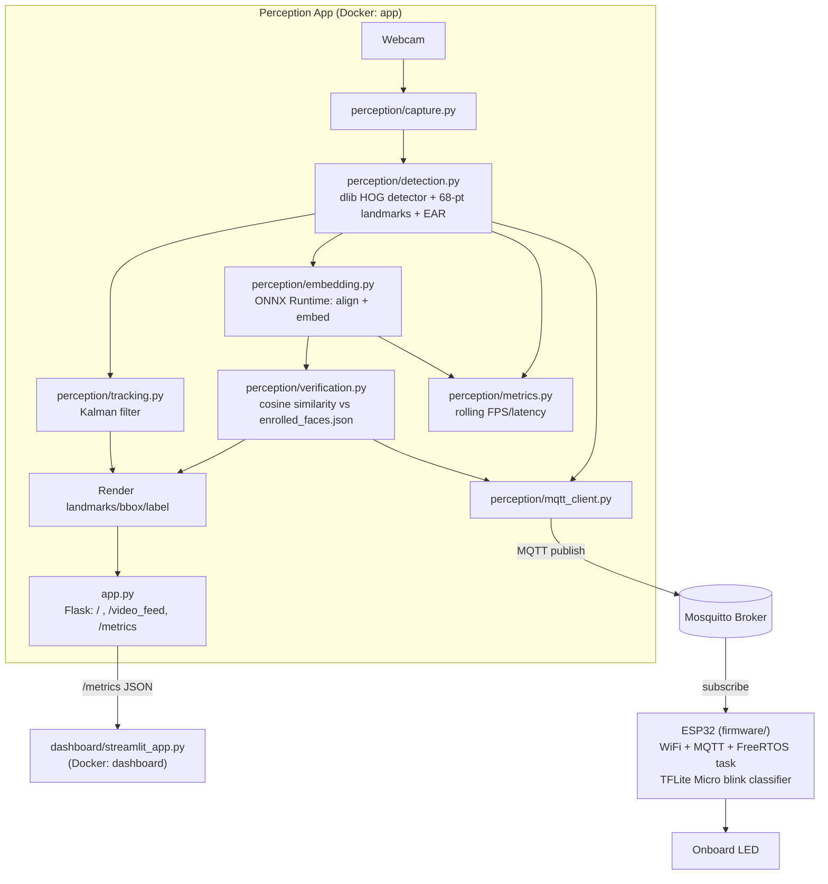
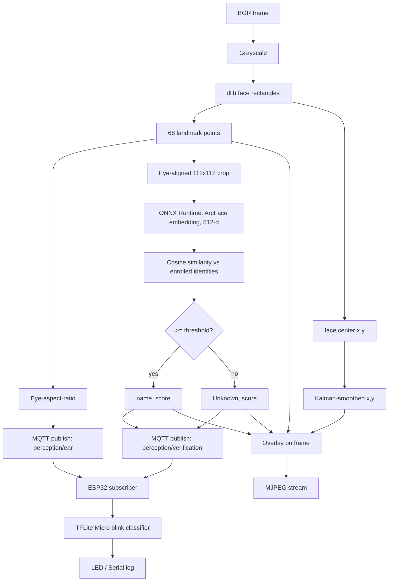
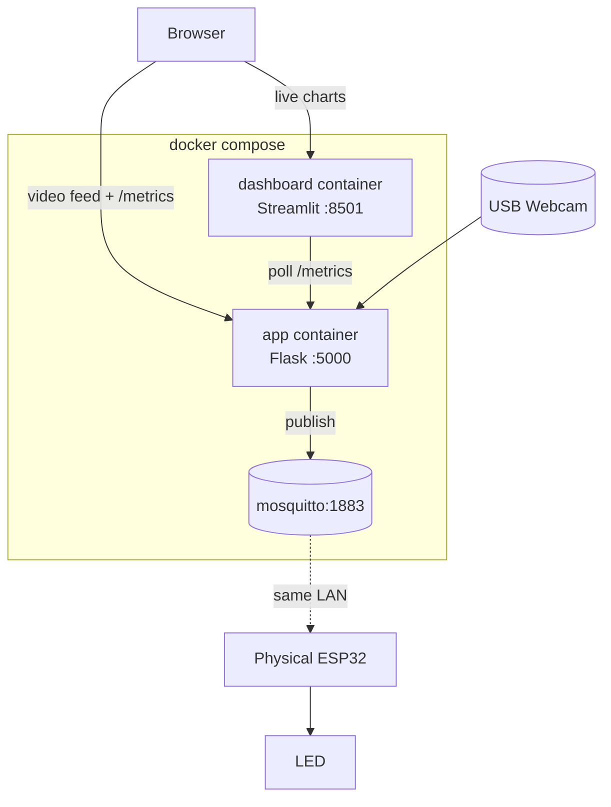

# Architecture

## Component diagram

```mermaid
graph TD
    subgraph Host["Perception App (Docker: app)"]
        Camera[Webcam] --> Capture[perception/capture.py]
        Capture --> Detection["perception/detection.py<br/>dlib HOG detector + 68-pt landmarks + EAR"]
        Detection --> Tracking["perception/tracking.py<br/>Kalman filter"]
        Detection --> Embedding["perception/embedding.py<br/>ONNX Runtime: align + embed"]
        Embedding --> Verification["perception/verification.py<br/>cosine similarity vs enrolled_faces.json"]
        Tracking --> Overlay[Render landmarks/bbox/label]
        Verification --> Overlay
        Overlay --> Flask["app.py<br/>Flask: / , /video_feed, /metrics"]
        Detection --> Metrics["perception/metrics.py<br/>rolling FPS/latency"]
        Embedding --> Metrics
        Verification --> Publisher["perception/mqtt_client.py"]
        Detection --> Publisher
    end

    Publisher -->|MQTT publish| Broker[(Mosquitto Broker)]
    Broker -->|subscribe| ESP32["ESP32 (firmware/)<br/>WiFi + MQTT + FreeRTOS task<br/>TFLite Micro blink classifier"]
    ESP32 --> LED[Onboard LED]

    Flask -->|/metrics JSON| Dashboard["dashboard/streamlit_app.py<br/>(Docker: dashboard)"]
```

## Data flow diagram

```mermaid
flowchart TD
    Frame[BGR frame] --> Gray[Grayscale]
    Gray --> Faces[dlib face rectangles]
    Faces --> Landmarks[68 landmark points]
    Landmarks --> EAR[Eye-aspect-ratio]
    Landmarks --> Align[Eye-aligned 112x112 crop]
    Align --> ONNX[ONNX Runtime: ArcFace embedding, 512-d]
    ONNX --> Cosine[Cosine similarity vs enrolled identities]
    Cosine --> Decision{">= threshold?"}
    Decision -->|yes| Verified[name, score]
    Decision -->|no| Unknown[Unknown, score]

    Faces --> KalmanIn[face center x,y]
    KalmanIn --> KalmanOut[Kalman-smoothed x,y]

    Verified --> MQTTPub[MQTT publish: perception/verification]
    Unknown --> MQTTPub
    EAR --> MQTTPubEAR[MQTT publish: perception/ear]

    MQTTPub --> ESP32In[ESP32 subscriber]
    MQTTPubEAR --> ESP32In
    ESP32In --> TFLM[TFLite Micro blink classifier]
    TFLM --> LEDOut[LED / Serial log]

    KalmanOut --> Frame2[Overlay on frame]
    Landmarks --> Frame2
    Verified --> Frame2
    Unknown --> Frame2
    Frame2 --> MJPEG[MJPEG stream]
```

## Deployment diagram

```mermaid
graph TB
    subgraph "docker compose"
        Mosquitto[(mosquitto:1883)]
        App["app container<br/>Flask :5000"]
        Dashboard["dashboard container<br/>Streamlit :8501"]
        App -->|publish| Mosquitto
        Dashboard -->|poll /metrics| App
    end

    Webcam[(USB Webcam)] --> App
    Browser[Browser] -->|video feed + /metrics| App
    Browser -->|live charts| Dashboard

    Mosquitto -.->|same LAN| ESP32HW[Physical ESP32]
    ESP32HW --> LEDHW[LED]
```
