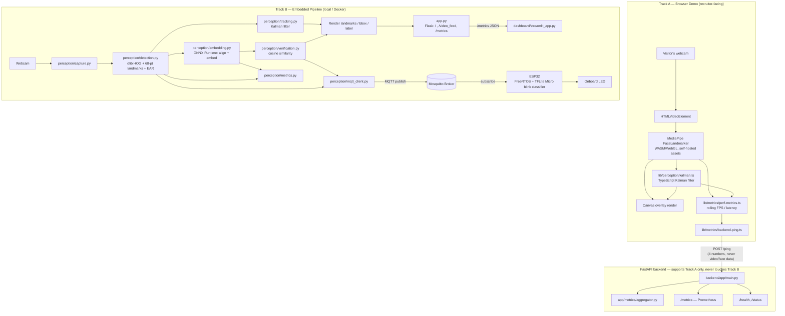
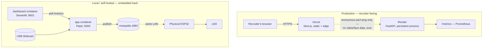
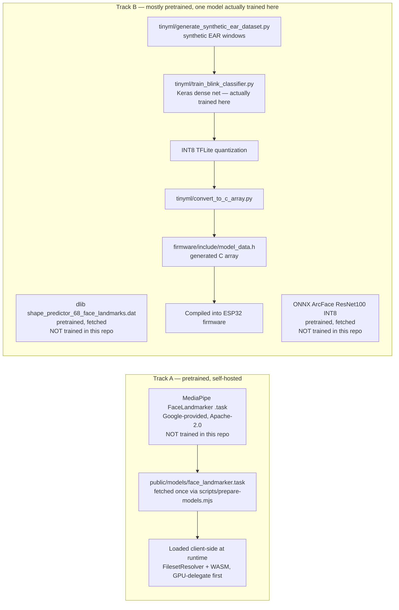

# Architecture

EdgeVision AI is two implementations of the same ideas — landmark detection,
Kalman-filtered tracking, and latency-aware metrics — built for different
purposes:

- **Track A — Browser demo**: a Next.js app running MediaPipe's
  FaceLandmarker entirely client-side (WASM/WebGL), instantly accessible at
  a public URL, with a TypeScript port of the Kalman filter and a FastAPI
  backend for health/metrics/anonymous perf reporting.
- **Track B — Embedded pipeline**: the original Python system — dlib
  landmarks, ONNX face embeddings, MQTT, and a real TensorFlow Lite Micro
  classifier running on physical ESP32 hardware — run locally via Docker
  Compose.

The two tracks share concepts, not runtime data: there is no edge between
them in production, and the FastAPI backend never talks to the Flask app.

## Component diagram

## Data flow diagram

```mermaid
flowchart TD
    subgraph FlowA["Track A — browser data flow"]
        A1[Camera frame] --> A2["MediaPipe detectForVideo()<br/>478 normalized landmarks"]
        A2 --> A3[Bounding box from landmark extent]
        A3 --> A4["TS Kalman: predict + correct"]
        A4 --> A5[Smoothed box + landmarks drawn on canvas]
        A2 --> A6[Inference latency, performance.now]
        A4 --> A7[Tracking latency, performance.now]
        A6 --> A8[PerfMetricsRecorder rolling window]
        A7 --> A8
        A8 -->|"every 6s, anonymized"| A9["POST /ping<br/>fps, inference_ms, tracking_ms, delegate"]
    end

    subgraph FlowB["Track B — embedded data flow"]
        B1[BGR frame] --> B2[Grayscale]
        B2 --> B3[dlib face rectangles]
        B3 --> B4[68 landmark points]
        B4 --> B5[Eye-aspect-ratio]
        B4 --> B6["Eye-aligned 112x112 crop"]
        B6 --> B7["ONNX Runtime: ArcFace embedding, 512-d"]
        B7 --> B8[Cosine similarity vs enrolled identities]
        B8 --> B9{">= threshold?"}
        B9 -->|yes| B10[name, score]
        B9 -->|no| B11[Unknown, score]
        B3 --> B12["face center (x, y)"]
        B12 --> B13["Kalman-smoothed (x, y)"]
        B10 --> B14["MQTT publish: perception/verification"]
        B11 --> B14
        B5 --> B15["MQTT publish: perception/ear"]
        B14 --> B16[ESP32 subscriber]
        B15 --> B16
        B16 --> B17[TFLite Micro blink classifier]
        B17 --> B18[LED / Serial log]
    end
```

## Deployment diagram

Why two deploy targets instead of one: Vercel's Python runtime executes each
request as a stateless function invocation, which can't reliably hold the
in-memory Prometheus counters and rolling aggregator the FastAPI backend
needs across requests. Render runs the backend as a normal persistent
process, where that state is real. The browser demo itself needs no backend
at all to function — `/ping` is purely supporting analytics infrastructure,
and the frontend degrades gracefully if it's unreachable.

## Model pipeline diagram

The blink classifier is the one model in this repository actually trained
from data here (synthetic, by design — see `tinyml/generate_synthetic_ear_dataset.py`).
Everything else — MediaPipe's landmarker, dlib's predictor, the ONNX ArcFace
model — is a pretrained artifact fetched from its public source, not
something this repo claims to have trained.
